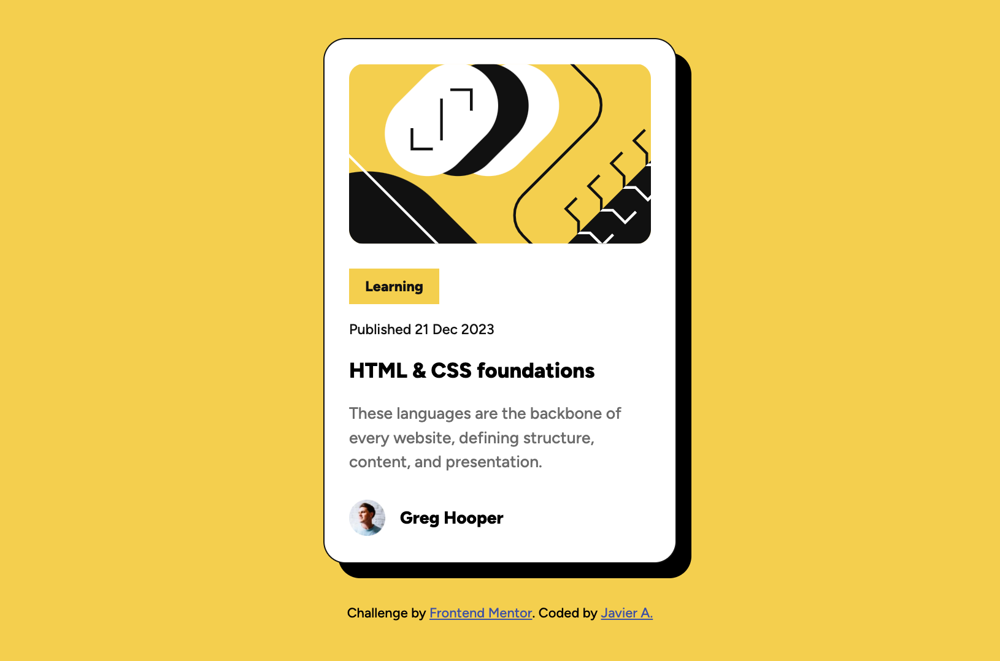

# Frontend Mentor - Blog preview card challenge soluction

## Welcome! 👋

This is a solution to the [Blog preview card challenge on Frontend Mentor](https://www.frontendmentor.io/challenges/blog-preview-card-ckPaj01IcS). Frontend Mentor challenges help you improve your coding skills by building realistic projects. 

## Table of contents

- [Overview](#overview)
  - [The challenge](#the-challenge)
  - [Screenshot](#screenshot)
  - [Links](#links)
- [My process](#my-process)
  - [Built with](#built-with)
  - [What I learned](#what-i-learned)
  - [Useful resources](#useful-resources)
- [Author](#author)
- [Acknowledgments](#acknowledgments)


## Overview

### The challenge

Users should be able to:

- See hover and focus states for all interactive elements on the page

### Screenshot



### Links

- Solution URL: [GitHub Directory](https://github.com/jasearce/frontendmentor-challenges/tree/main/02-blog-preview-card-main)
- Live Site URL: [Netlify App](https://blog-postcard-frontendmentor.netlify.app/)

## My process

### Built with

- Semantic HTML5 markup
- CSS custom properties
- Flexbox


### What I learned

How to apply semantic HTML5 with responsive CSS properties like ```clamp()``` without the use of media queries.


### Useful resources

- [MDN Docs](https://developer.mozilla.org/en-US/) - The MDN Docs was very helpful for researching about ```clamp``` and ```calc()``` CSS functions for responsiveness.
- [CSS Scan](https://getcssscan.com/css-box-shadow-examples) - CSS Scan was a nice resource to understand and select a similar box shadow for the card container.


## Author

- Frontend Mentor - [@jasearce](https://www.frontendmentor.io/profile/jasearce)
- GitHub - [jaseace](https://github.com/jasearce)
