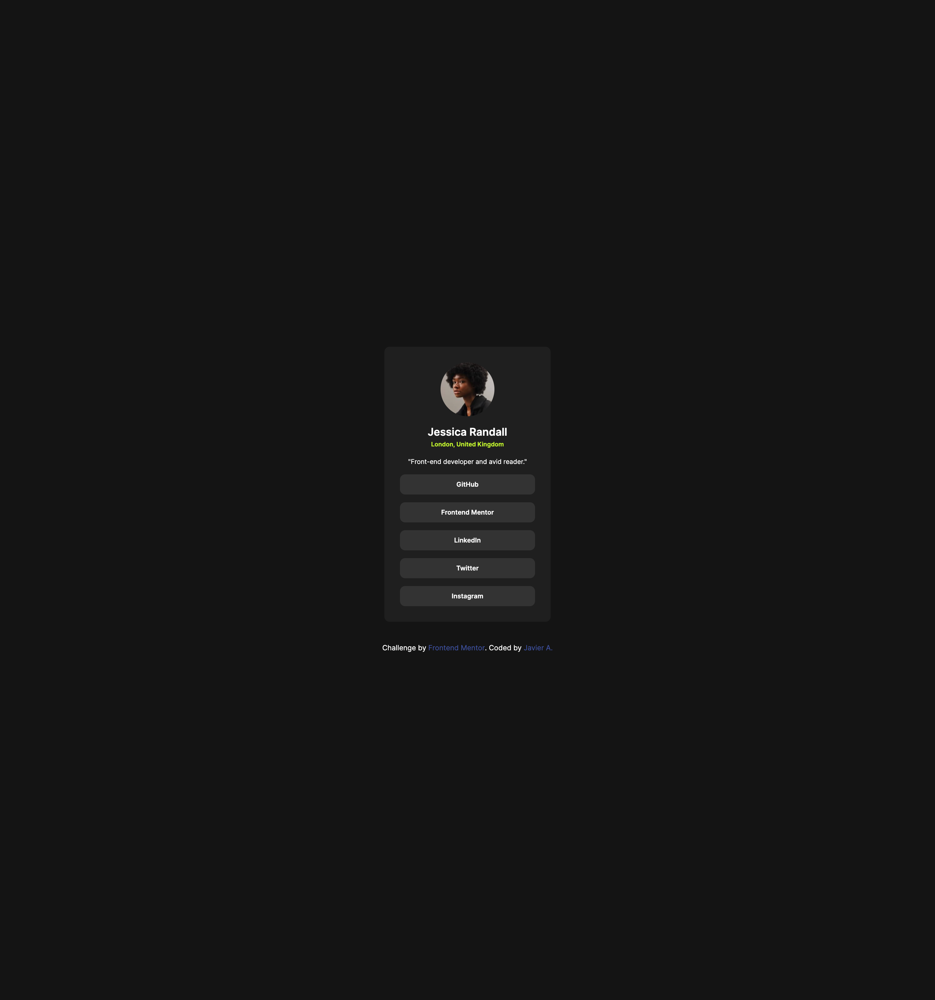

# Frontend Mentor - Social links profile solution

## Welcome! 👋

This is a solution to the [Social links profile challenge on Frontend Mentor](https://www.frontendmentor.io/challenges/social-links-profile-UG32l9m6dQ). Frontend Mentor challenges help you improve your coding skills by building realistic projects. 

## Table of contents

- [Overview](#overview)
  - [The challenge](#the-challenge)
  - [Screenshot](#screenshot)
  - [Links](#links)
- [My process](#my-process)
  - [Built with](#built-with)
  - [What I learned](#what-i-learned)
  - [Useful resources](#useful-resources)
- [Author](#author)
- [Acknowledgments](#acknowledgments)


## Overview

### The challenge

Users should be able to:

- See hover and focus states for all interactive elements on the page

### Screenshot



### Links

- Solution URL: [GitHub Directory](https://github.com/jasearce/frontendmentor-challenges/tree/main/03-social-links-profile-main)
- Live Site URL: [Netlify App](https://social-links-profile-ftendmentor-jarc.netlify.app/)

## My process

### Built with

- Semantic HTML5 markup
- CSS custom properties
- Flexbox


### What I learned

How to apply semantic HTML5 with responsive CSS properties, how to import custom fonts and apply style to new properties of HTML elements.


### Useful resources

- [MDN Docs](https://developer.mozilla.org/en-US/) - The MDN Docs was very helpful for researching about ```clamp``` and ```calc()``` CSS functions for responsiveness.
- [CSS Scan](https://getcssscan.com/css-box-shadow-examples) - CSS Scan was a nice resource to understand and select a similar box shadow for the card container.


## Author

- Frontend Mentor - [@jasearce](https://www.frontendmentor.io/profile/jasearce)
- GitHub - [jaseace](https://github.com/jasearce)


## Acknowledgments

A tip here for anyone is when givin styles to the structure you should try over and over again until you can get the most similar result. Also, when finished my code I uploaded to Grok to check how much similarity I made with the given designs.
